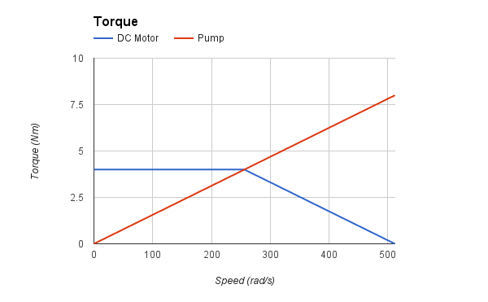

# Disclaimers
I enjoy Rotarycraft and I think it's one of the best industry mods. What follows shouldn't be taken as criticism but
rather as a humble suggestion on how an already great mod could maybe be made even better.

I also appreciate and respect the efforts Reika has made in balance and progression and I try throughout to respect
that.

It's worth noting that I'm still on my first play through however I have all the bedrock toys and an automated extractor
setup so I feel I'm reasonably familiar with the mod.


# Overview
The basic suggestion here is to treat an entire network of engines and machines as a
single entity and calculate the speed where the torque produced by the engines is equal to the
torque consumed by the machines.

This is backed with proof of concept code on how to do the math relatively efficiently and explanatory text on how to
maintain the existing balance.


# Motivation
A couple things in Rotarycraft bug me, things that don't feel quite right.

Somewhere in the docs it says "the "load" on a shaft has no effect on its power consumption - a disconnected shaft still
draws any and all power given to it, but simply wastes it".

In reality a dangling shaft just spins and aside from adding a little friction has no effect on the rest of the system.
Currently in Rotarycraft that dangling shaft will waste a significant portion of the total power.

This also has the effect of making clutches less useful, they can turn off machines, but they can't divert the power the
machine was using elsewhere.

Also the handling of junctions in general makes line shaft (http://en.wikipedia.org/wiki/Line_shaft) setups impractical,
as adding a new engine or machine to the line can require adjusting multiple junctions and the ratios they support are
limited.

I understand the power buses and multidirectional clutches are supposed to help with these use cases, but it feels like
pasting over the real problems with additional complexity.

And finally having input and output ends on shafts and gearboxes etc is a bit weird, in reality these are inherently
reversible objects. Likewise with the torque ratio on shaft junctions.

The rest of this article is about addressing these issues and doing so without impacting balance and with minimal
performance cost.


# Principles
0: Power = Torque * Speed, the Rotarycraft fundamental law.

1: Engine torque produced generally decreases as speed increases (and eventually hits 0).

2: Machine torque consumed generally increases as speed increases (and eventually goes to infinity). note: due to pt0
the power (produced / consumed) curves do not follow these torque curves, power can actually increase and decrease
across the speed range.

3: These torque curves may change over time or depending on fuel etc.

4: Gears simply apply a multiplicative transformation to the torque curves, multiplying and dividing the axes.

5: Equilibrium speeds exist where the total torque produced and consumed curves cross (n.b. due to pt0 this is also
where the power curves cross). When generated torque > consumed torque speed increases and vice versa bringing the
system back to an equilibrium speed.

6: Engines may have an additional function mapping speed to fuel use.

7: Machines may have an additional function mapping speed to cycle time.


# Additional simplifying restrictions
1b: Engine torque may not increase with speed, subsequently at speed 0 all engines are at max torque.

2b: Machine torque is strictly increasing only, subsequently at speed 0 all machines are at zero torque.

5b: These restrictions mean any setup has exactly 1 equilibrium speed.

I discuss what happens if you remove these restrictions under "Dynamic variant" at the end.


# Changes from Rotarycraft
No input and output sides.

No need for torque ratios on shaft junctions.

No speed / torque mode on gearboxes you just turn them around.

A dangling shaft consumes no power.


# Calculating the equilibrium speed
Calculating the current equilibrium can be done in a single pass, there is no need to iteratively seek the solution.
That pass consists of three steps:

1: Gather the total torque produced and consumed curves for the whole network.

2: Calculate the equilibrium speed.

3: Distribute the actual speed back through the network so load limits and cycle times can be calculated.

The associated code implements gather and distribute as recursive depth first searches and can proceed from any point in
the network (the origin) applying gearing transformations as it proceeds.

Gather passes around and combines Lines, these are chains of straight line segments. Dealing only in straight segments
makes all the math much easier and I haven't found a compelling need for curves yet (n.b. straight segments in the
torque curves produce parabolic segments in the power curves).

Gather ultimately produces the total torque produced and consumed lines for the whole network. Calc intersects these to
produce the equilibrium speed at the origin.

Distribute then spreads this speed back through the network (again applying gearing transformations) so that we can
calculate the actual speed and transferred torque at every point.


# Making it faster
If the recursive traversal is an issue then it could of course be made iterative, but that would be a lot more fiddly.

You could also cache a bunch of stuff, every block would need a quick way to find the origin of it's network. Then at
the origin you would need a list of every engine and machine and their gear differences with respect to the origin. That
would let you skip gather for non topology changes, and work out the speed at each engine and machine. However to get
the true transmitted torque I think you still have to run distribute, but that could be done less frequently as it's
only needed for load limit checks.

I need to think some more to see if I can concoct a way of doing the calculation as block to block updates like
redstone, I'm not optimistic about the chances of that being possible.


# Replicating the current balance
For the simpler devices you can draw the torque produced and consumed curves to replicate the existing output / minimum
input.

The generic statement I have above as principle 7 lets you independently control things like decreasing cycle
times with increasing speed and minimum speed cutoffs. These curves also need to be redrawn from current ones but these
two mechanics let you get many simple setups working with a close approximation of current balance.

For example here's the theory diagrams from above redrawn for a DC electric motor and a pump:





As you can see the equilibrium is the same as what you get hooking these together in Rotarycraft.

You'll note that I changed the shape of the engine curve, this isn't strictly necessary but reduces the chance of
accidentally introducing balance breaking behavior.

I mentioned above that gears transform the curves, here's an example of that:


Note that in this instance the wind turbine is acting as the origin and so the equilibrium speed is at a 1:1 gearing
with the wind turbine. Distribute would of course then calculate what the actual torque and speed for the grinder are.

Principle 3 covers off the rest of the interesting engine behavior, microturbine windup, hydrokinetic fall height etc.

That brings us to the machines, most of these are already dealt with by the above, however there are some problems. The
extractor is an interesting example both of those problems and advanced balance mechanics. The heart of the issue is
that speed and torque inputs to a machine are now coupled, so you can't use the ratio between them as a mechanism for
controlling the behavior of the machine.

For the extractor I've only found one way around this issue that preserves it's very unusual balance mechanism. That is
to give each stage an enable switch in the GUI and have separate torque curves for all 15 combinations. Choosing those
torque curves to replicate the current minimum requirements to run just the associated stages.

The friction heater has a similar problem but unfortunately in that instance the only option seems to be to drop the
efficiency mechanic entirely, perhaps replacing it with something new.

Moving on, flywheels are another interesting case, these essentially have an internal speed and act as engines below
that speed and machines above it, with very steep torque curves that constrain the whole network to remain near the
speed of the flywheel. I haven't done a proof of concept of these yet but I'm confident it can be managed.


# Dynamic variant
I another variant on this system, the one detailed above I call static it is simpler, has better compatibility with
existing Rotarycraft and handles chunk loading smoother, the other I call dynamic.

We remove the "additional simplifying restrictions", which allows for some interesting additional behavior.

A setup may have multiple equilibrium speeds and manipulating the system in real time can bump it from one equilibrium
to another.

This allows for engine that can stall out and machines that require extra torque to get them started. It can even allow
for engines that require starter motors.

In practice this is only fractionally harder to calculate. However in game play terms it makes things a lot more
temperamental and fiddly and brings in problems like chunk unloading and reloading causing your whole system to stall
out requiring a manual restart process.

Ultimately I'm not convinced that these behaviors are worth the extra complexity.


# An example of the difference between the variants
We have a steam engine driving some machines, the system is turning and at equilibrium.

We add a new machine to the line (perhaps by engaging a clutch) overloading the steam engine, the setup winds down to a
halt, technically we've lifted the consumed torque curve so the only equilibrium speed is at 0.

We remove the new machine returning the setup to it's previous state.

In the static system the steam engine has max torque at 0 speed so it spins up to it's old speed and the setup returns
to the old (and only) equilibrium speed.

In the dynamic system the steam engine might have no torque at low speed, so it can't restart the existing machines,
it's effectively stalled, technically speaking the setup actually has two equilibrium speeds the second being at 0
speed, before we messed with it it was operating at the higher equilibrium speed, now we've bumped it to the lower one.

To restart the steam engine we have to remove all the load so it is free to spin up to full speed, then we can reattach
the load and it will settle into the original equilibrium.


# Appendix: Code
There are other files of note in repository:

* [lib.py](lib.py) - proof of concept implementations of Line, gather, calc and distribute
* [rotarycraft.py](rotarycraft.py) - various example uses of lib.py
* [rotarycraft.txt](rotarycraft.txt) - example output from running rotarycraft.py

The format of the rotarycraft.py examples and output might not be the clearest, so I will explain one, first the code:

```python
Shaft(
    GearBox((32, WindTurbine()), Grinder()),
    GearBox((32, WindTurbine()), Grinder()),
)
```
This setup is a shaft linking two matching pairs of wind turbine and grinder connected by 32x gearbox.
Think of it as an H shape, grinders on the top of the legs, wind turbines on the bottom, shaft as the bar and gearboxes
connecting the intersections.

And now the output:
```
Link               speed   torque    power
  WindTurbine    1024.00     4.00  4096.00
  Grinder          32.00   128.00  4096.00
 GearBox           32.00   128.00  4096.00
  WindTurbine    1024.00     4.00  4096.00
  Grinder          32.00   128.00  4096.00
 GearBox           32.00   128.00  4096.00
Shaft              32.00     0.00     0.00
```
What you see here is the wind turbines are transmitting 4kW of power @ 1024rad/s through the gearboxes to the grinders
which are consuming it at 32 rad/s. The interesting bit is since both sides of the H are balanced the shaft isn't
transmitting any torque or power, however it is of course turning.


# Fin
